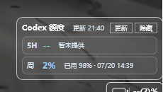

# Codex Usage Taskbar Skill

这是一个 Windows Codex 用量任务栏组件的 Skill 包。它从本机 Codex 读取 5 小时与周额度，在任务栏旁显示剩余额度，并包含悬停详情、手动刷新、托盘菜单和随 Codex 自动启动的实现约束。

## 效果预览

紧凑状态条显示在 Windows 任务栏右上方：



仓库核心只有一个文件夹：[`codex-taskbar-usage-widget/`](./codex-taskbar-usage-widget/)。其中：

- `SKILL.md`：让 Codex 设计、创建、修复或改造组件的规则；
- `source/`：可直接复用的同款 WPF 实现，包括窗口、额度读取、启动器和自动启动脚本。

## 方式一：只安装 Skill，让 Codex 自行设计

只需要保留 `codex-taskbar-usage-widget/SKILL.md`。将它放到本机：

```text
%USERPROFILE%\.codex\skills\codex-taskbar-usage-widget\SKILL.md
```

重启 Codex 或新建任务后，使用类似下面的提示词：

> 使用 `codex-taskbar-usage-widget` skill，为我设计并实现一个 Windows 任务栏旁的 Codex 用量组件。保持玻璃风格，但将状态条改成圆角胶囊；完成后构建并验证。

这种方式由 Codex 根据 Skill 的约束自行决定项目结构与视觉细节，适合希望获得定制版本的用户；`source/` 不是必需项。

## 方式二：安装 Skill，并直接复用同款源码

保留完整的 `codex-taskbar-usage-widget/` 文件夹：`SKILL.md` 与 `source/` 必须在一起。将文件夹放进 `%USERPROFILE%\.codex\skills\`，或复制 `source/` 到一个目标工作区。

然后使用下面的提示词：

> 使用 `codex-taskbar-usage-widget` skill。不要从零设计：请直接复用该 skill 同目录 `source/` 中的 WPF 项目，在一个新的空工作区复制源码，构建、启动并验证 Windows 上的 Codex Usage Taskbar。除非我明确要求，否则不要改变 UI、刷新逻辑或自动启动行为。

这会复用当前仓库中已构建验证的同款窗口、额度读取逻辑、启动器与自动启动脚本。它不是脱离环境的二进制“一键安装包”：目标机器仍需要 **Windows、.NET 9 SDK、已登录的 Codex**，并且 Codex 必须能成功构建和启动项目。满足这些前提时，Codex 可以自动完成复制、构建和启动，从而得到同款效果。

如果要手动构建：

```powershell
cd codex-taskbar-usage-widget\source
dotnet build CodexUsageTaskbar.sln -c Release
```

## 方式三：直接把 GitHub 地址交给 Codex

无需预先手动下载。把下面仓库地址和提示词直接发给 Codex：

> 使用 `https://github.com/neystan/codex-usage-taskbar-skill.git`。请拉取仓库，阅读 `README.md` 与 `codex-taskbar-usage-widget/SKILL.md`，然后根据我的目标选择实现方式：需要定制时遵循 Skill 自行设计；需要同款时优先复用 `codex-taskbar-usage-widget/source/`。在新工作区完成构建和验证，不要修改原始克隆目录。

前提是目标用户对该仓库有读取权限，且其 Codex 环境可以执行 Git、.NET 构建与本机启动操作。
